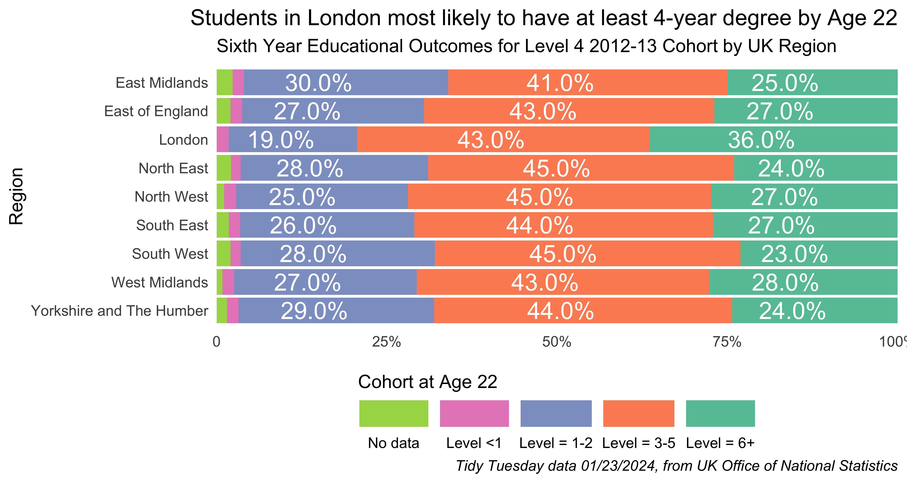
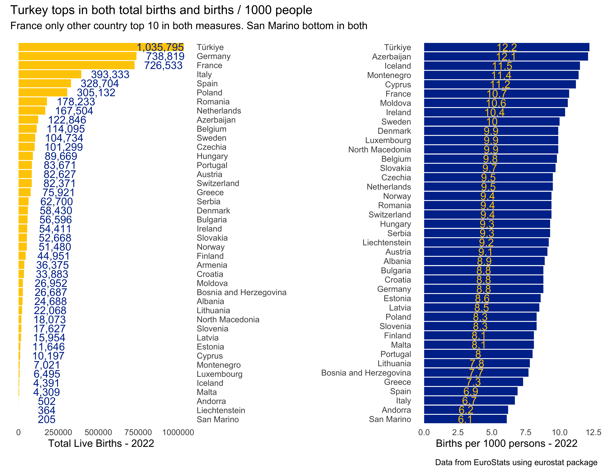
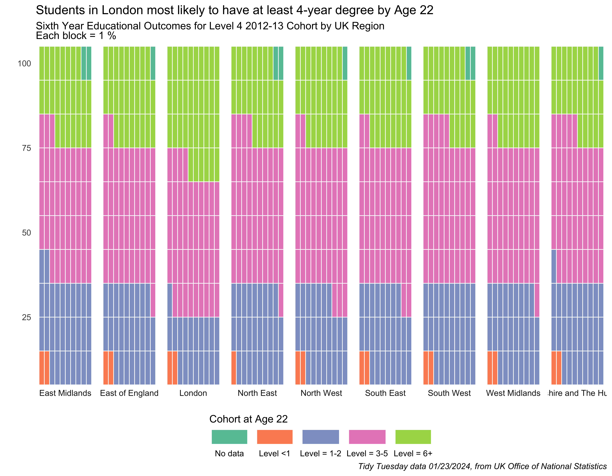
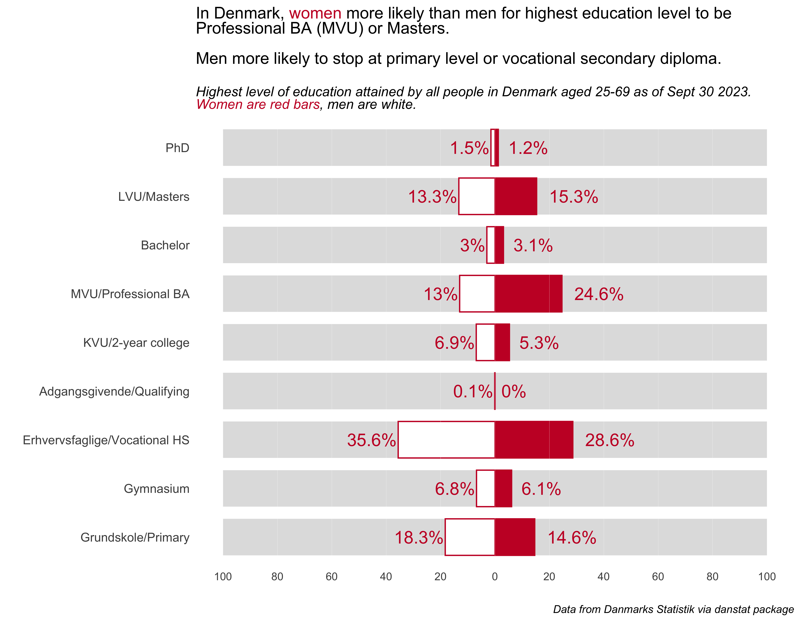
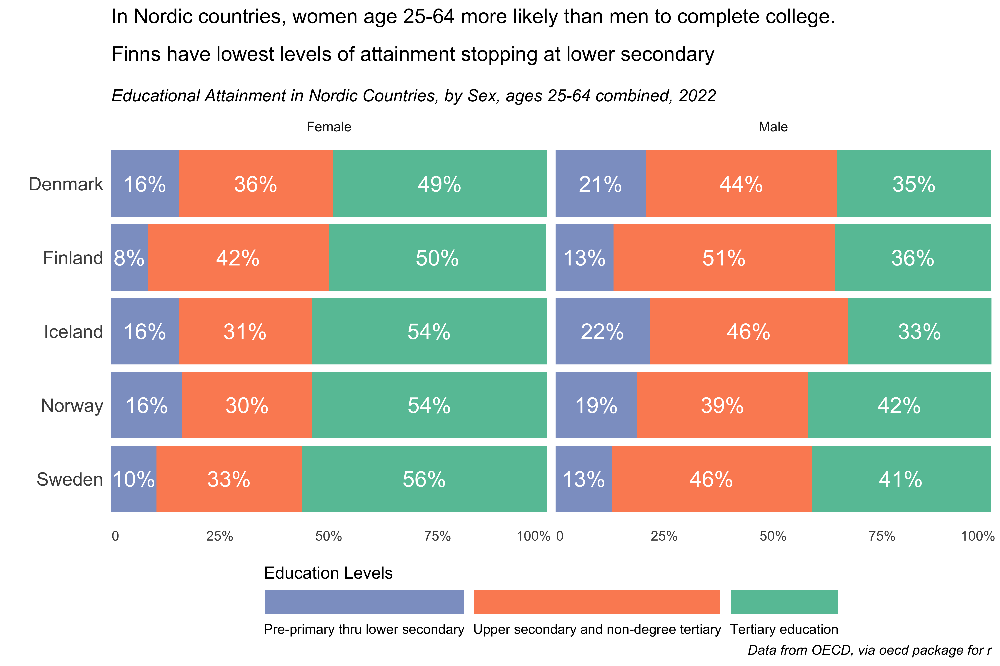
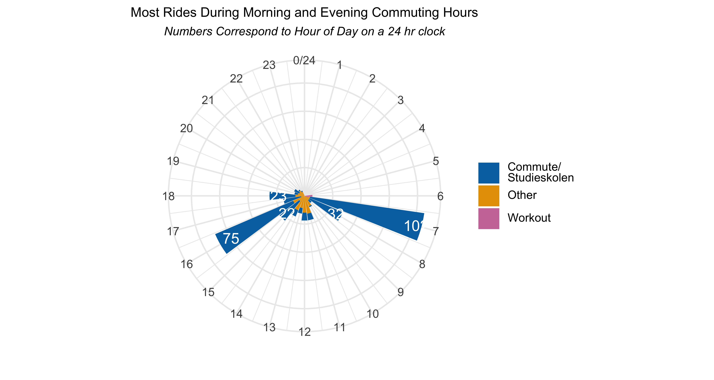
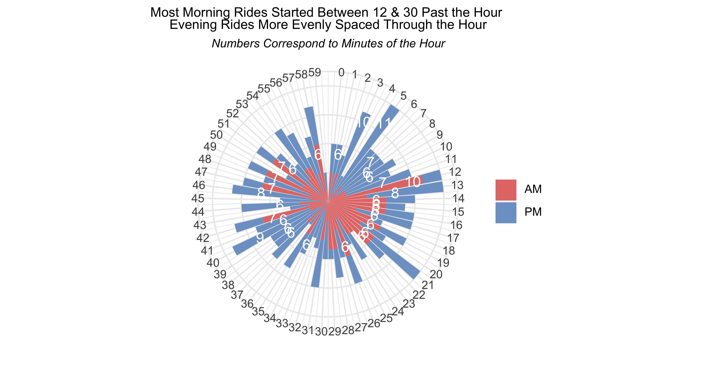

# 30 Day Chart Challenge - 2024

A repository containing code for the 2024 edition of the 30 Day Chart Challenge. 

More details on the challenge at [GitHub](https://github.com/30DayChartChallenge/Edition2024). 

Follow my contributions on [my data blog](https://www.gregdubrow.io/posts/30-day-chart-challenge-2024/).

All contributions made with R unless otherwise noted. Because I started the challenge late, I did not complete one for every prompt.

## [Prompt 1 - Comparisons: Part to whole](https://www.gregdubrow.io/posts/30-day-chart-challenge-2024/#prompt1)

## [Prompt 2 - Comparisons: Neo](https://www.gregdubrow.io/posts/30-day-chart-challenge-2024/#prompt2)

## [Prompt 3 - Comparisons: Redo & Waffle](https://www.gregdubrow.io/posts/30-day-chart-challenge-2024/#prompts3and4)

## [Prompt 5 - Comparisons: Diverging](https://www.gregdubrow.io/posts/30-day-chart-challenge-2024/#prompt5)

## [Prompt 6 - Comparisons: OECD](https://www.gregdubrow.io/posts/30-day-chart-challenge-2024/#prompt6)

## [Prompt 7 - Comparisons: OECD](https://www.gregdubrow.io/posts/30-day-chart-challenge-2024/#prompt7)

## [Prompt 8 - Comparisons: OECD](https://www.gregdubrow.io/posts/30-day-chart-challenge-2024/#prompt8)

## [Prompt 9 - Comparisons: OECD](https://www.gregdubrow.io/posts/30-day-chart-challenge-2024/#prompt9)

