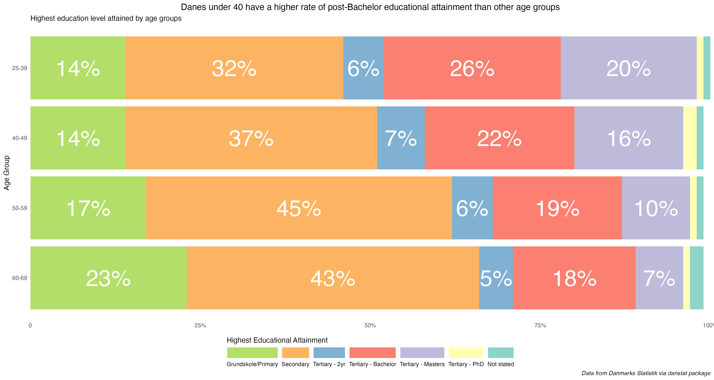

# 30 Day Chart Challenge - 2025

A repository containing code for the 2025 edition of the 30 Day Chart Challenge. 

More details on the 2025 challenge at [GitHub](https://github.com/30DayChartChallenge/Edition2025).

Follow my contributions on [my data blog](https://www.gregdubrow.io/).

All contributions made with R unless otherwise noted. 

## [Day 1 - Comparisons: Fractions](https://www.gregdubrow.io/)

## [Day 2 - Comparisons: Slope](https://www.gregdubrow.io/)
