# 30 Day Chart Challenge - 2025

A repository containing code for the 2025 edition of the 30 Day Chart Challenge. 

More details on the 2025 challenge at [GitHub](https://github.com/30DayChartChallenge/Edition2025).

Follow my contributions on [my data blog](https://www.gregdubrow.io/posts/30-day-chart-challenge-2025/). 
I'll also post to [BlueSky](https://bsky.app/profile/gregerskjerulf.bsky.social) 
and [LinkedIn](https://www.linkedin.com/in/dubrowg/).

All contributions made with R unless otherwise noted. 

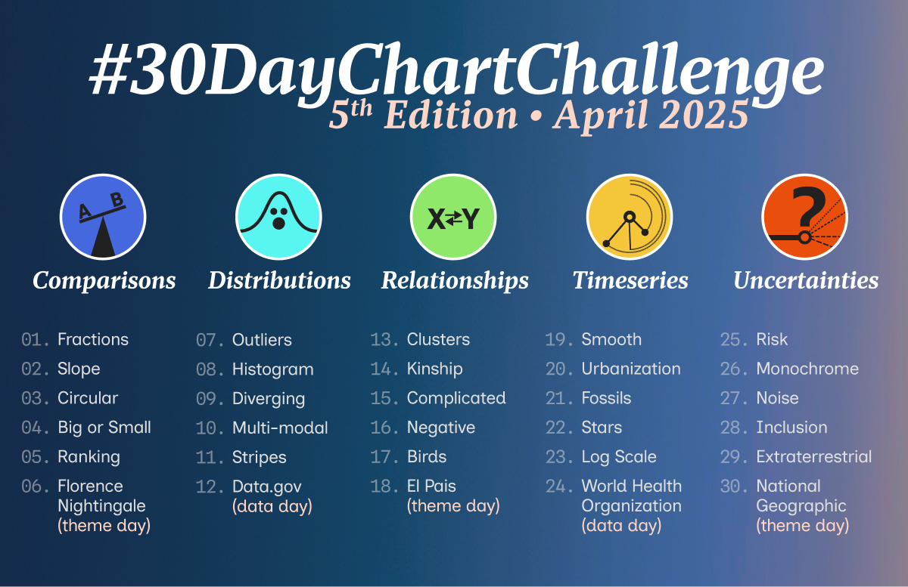

## [Day 1 - Comparisons: Fractions](https://www.gregdubrow.io/posts/30-day-chart-challenge-2025/#prompt1)

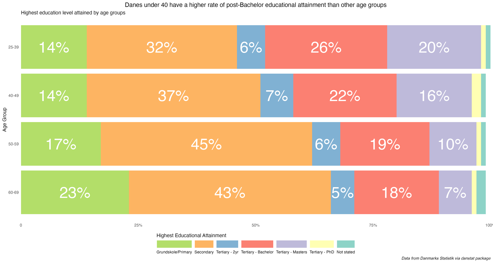

## [Day 2 - Comparisons: Slope](https://www.gregdubrow.io/posts/30-day-chart-challenge-2025/#prompt2)

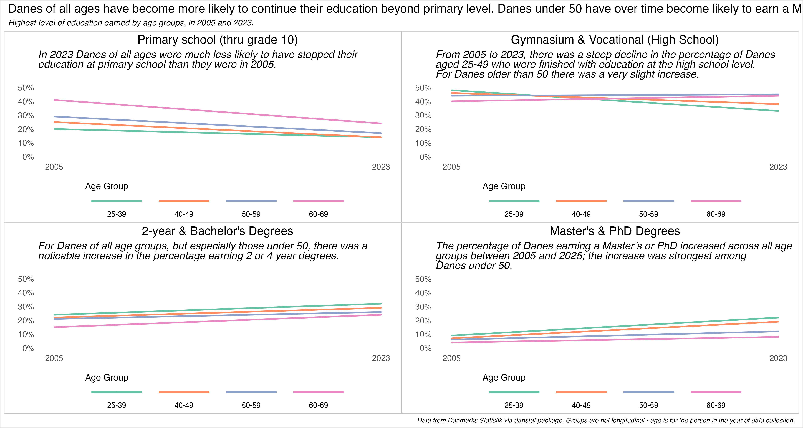

## [Day 3 - Comparisons: Circular](https://www.gregdubrow.io/posts/30-day-chart-challenge-2025/#prompt3)

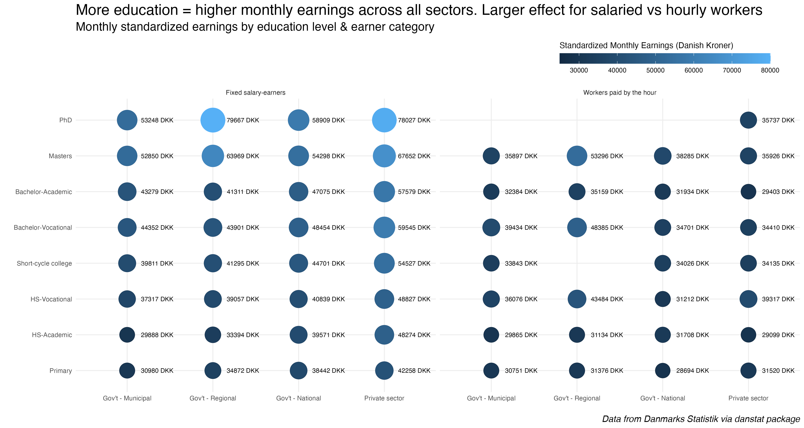

## [Day 4 - Comparisons: Big or Small](https://www.gregdubrow.io/posts/30-day-chart-challenge-2025/#prompt4)

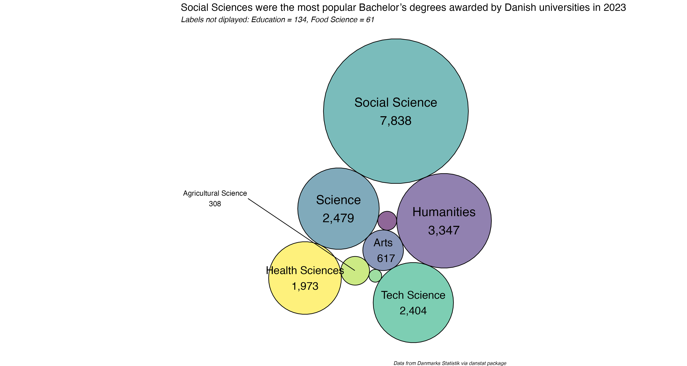

## [Day 5 - Comparisons: Ranking](https://www.gregdubrow.io/posts/30-day-chart-challenge-2025/#prompt5)

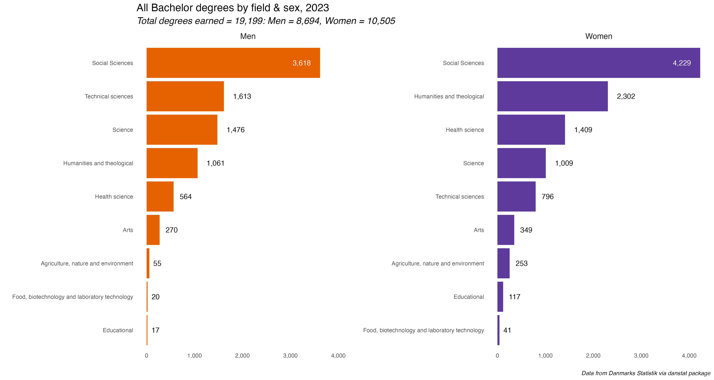

## [Day 6 - Comparisons: Florence Nightingale](https://www.gregdubrow.io/posts/30-day-chart-challenge-2025/#prompt6)

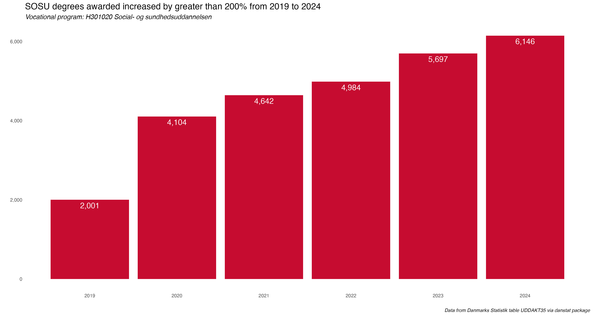

## [Day 7 & 8 - Distributions: Outliers & Histogram](https://www.gregdubrow.io/posts/30-day-chart-challenge-2025/#prompts7and8)

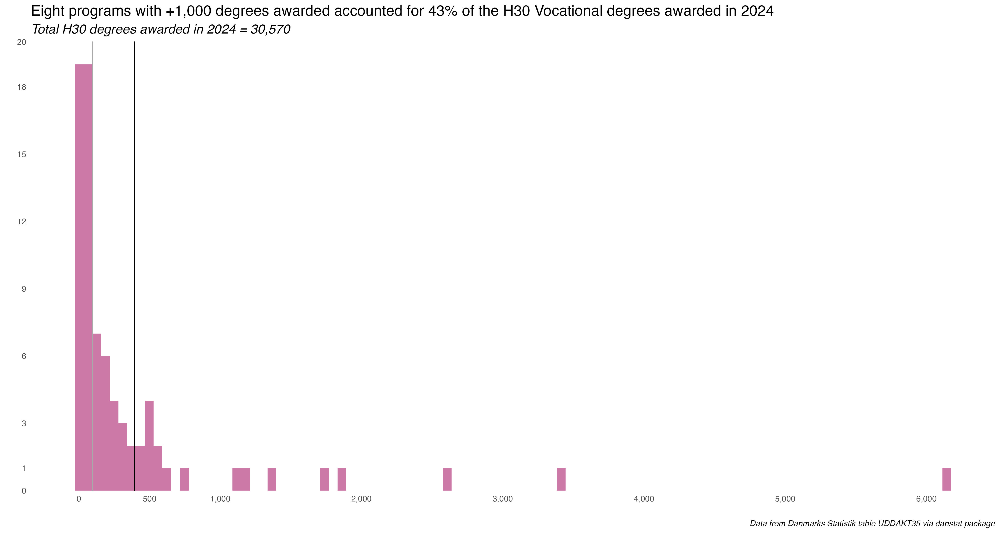

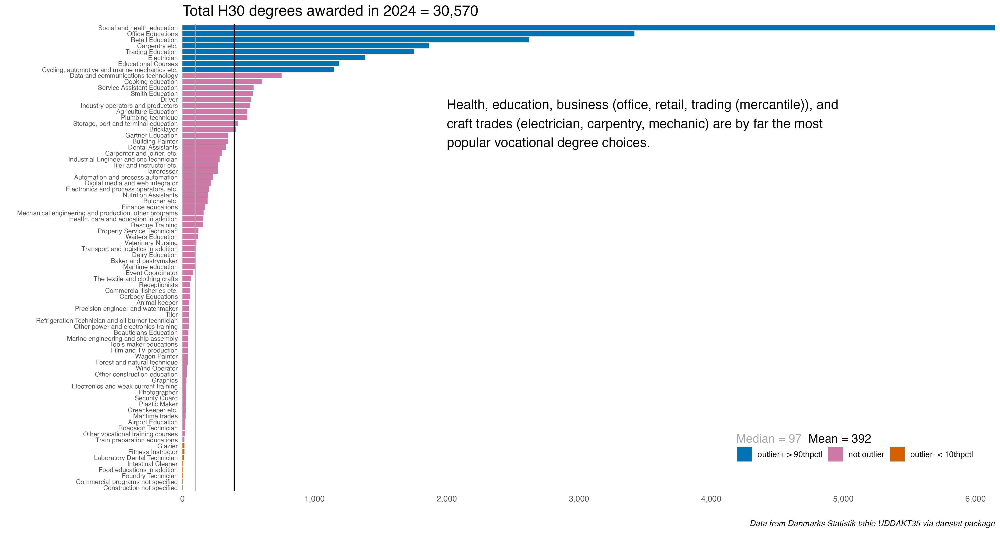

## [Day 9 - Distributions: Diverging](https://www.gregdubrow.io/posts/30-day-chart-challenge-2025/#prompt9)

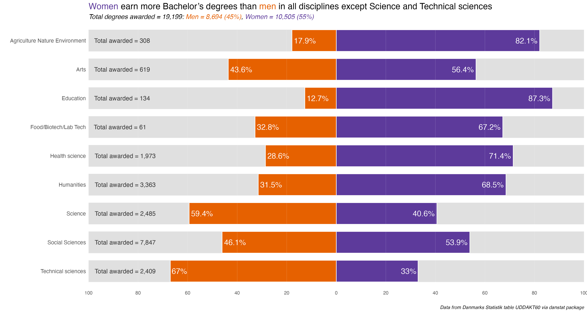

## [Day 13 - Relationships: Clusters](https://www.gregdubrow.io/posts/30-day-chart-challenge-2025/#prompt13)

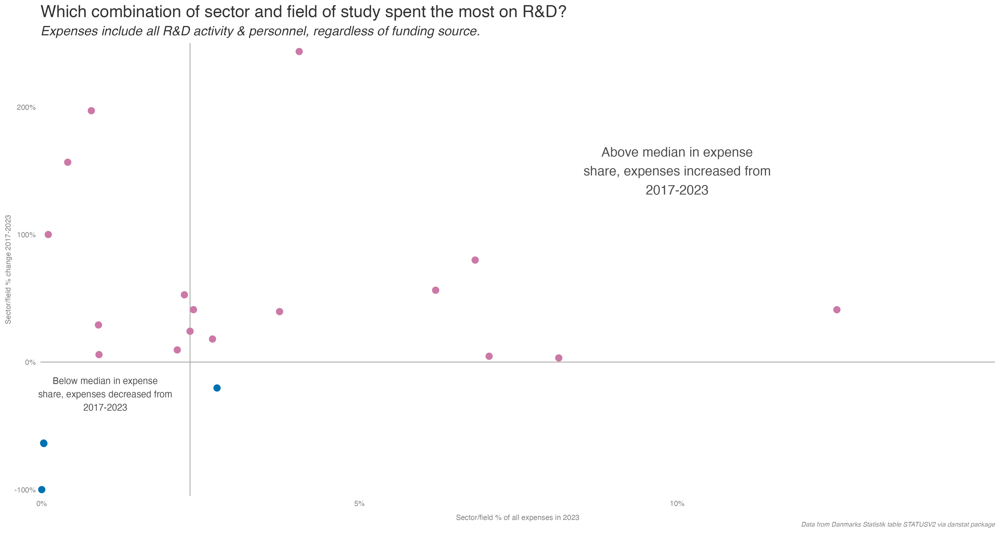

## [Day 14 - Relationships: Kinship](https://www.gregdubrow.io/posts/30-day-chart-challenge-2025/#prompt14)

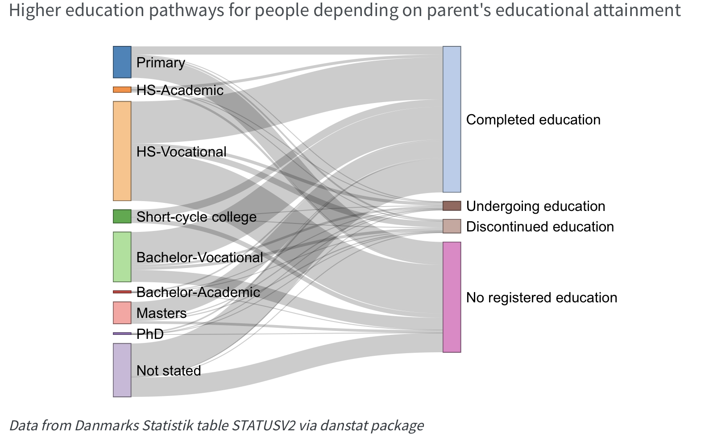

## [Day 15 - Relationships: Complicated](https://www.gregdubrow.io/posts/30-day-chart-challenge-2025/#prompt15)

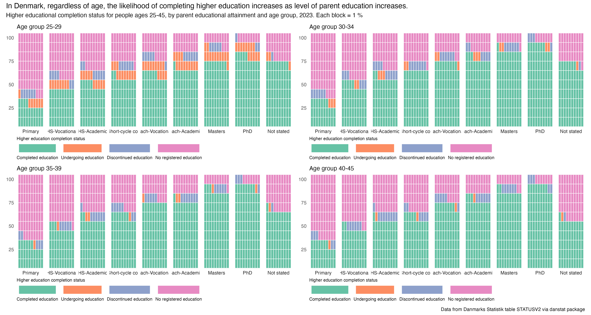

## [Day 19 - Time Series: Smooth](https://www.gregdubrow.io/posts/30-day-chart-challenge-2025/#prompt19)

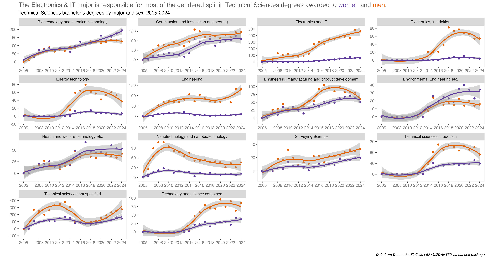

## [Day 20 - Time Series: Urbanization](https://www.gregdubrow.io/posts/30-day-chart-challenge-2025/#prompt20)

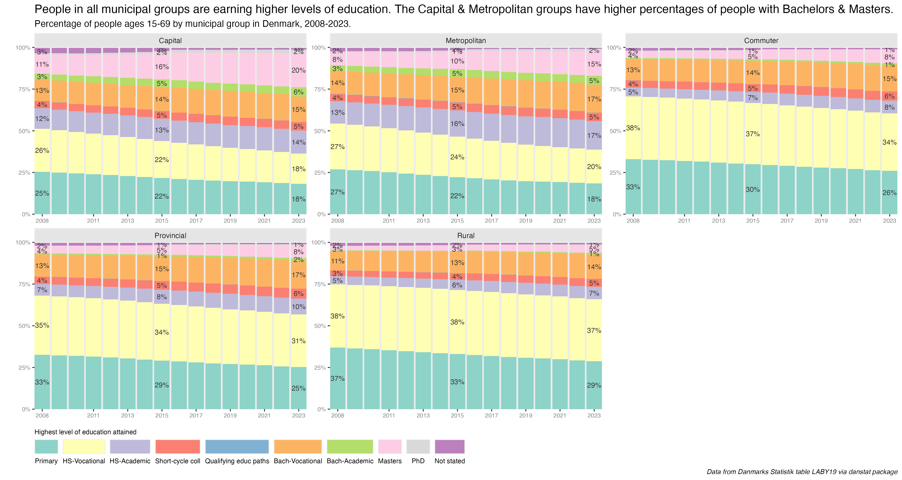

## [Day 23 - Time Series: Log](https://www.gregdubrow.io/posts/30-day-chart-challenge-2025/#prompt23)

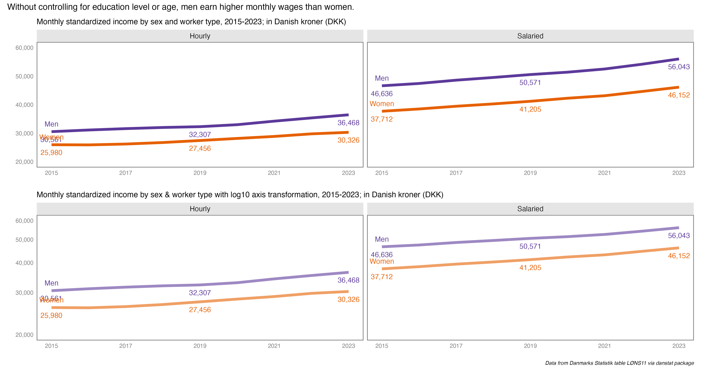

