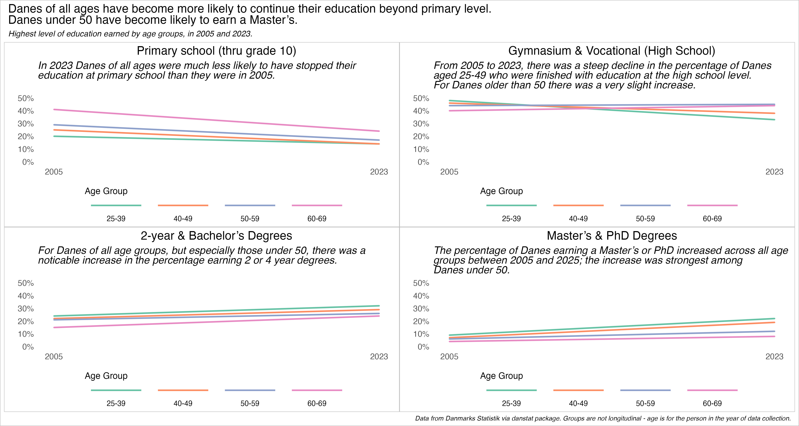

# 30 Day Chart Challenge - 2025

A repository containing code for the 2025 edition of the 30 Day Chart Challenge. 

More details on the 2025 challenge at [GitHub](https://github.com/30DayChartChallenge/Edition2025).

Follow my contributions on [my data blog](https://www.gregdubrow.io/posts/30-day-chart-challenge-2025/). 
I'll also post to [BlueSky](https://bsky.app/profile/gregerskjerulf.bsky.social) 
and [LinkedIn](https://www.linkedin.com/in/dubrowg/).

All contributions made with R unless otherwise noted. 

## [Day 1 - Comparisons: Fractions](https://www.gregdubrow.io/posts/30-day-chart-challenge-2025/#prompt1)

## [Day 2 - Comparisons: Slope](https://www.gregdubrow.io/posts/30-day-chart-challenge-2025/#prompt2)

## [Day 3 - Comparisons: Circular](https://www.gregdubrow.io/posts/30-day-chart-challenge-2025/#prompt3)

